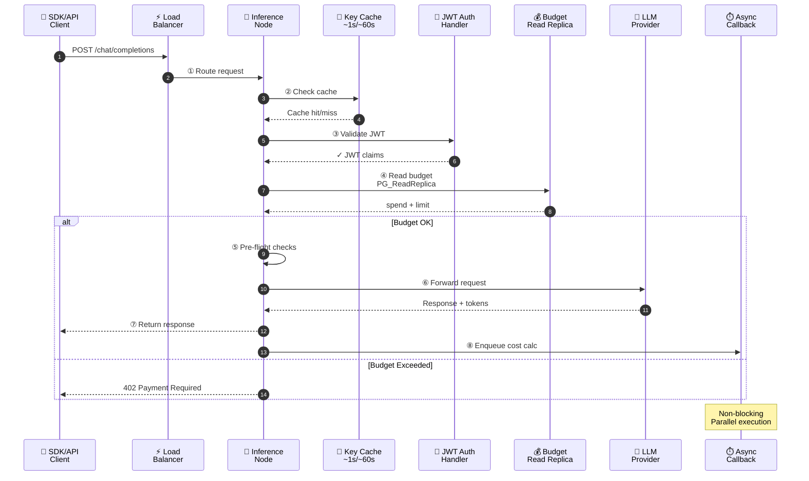
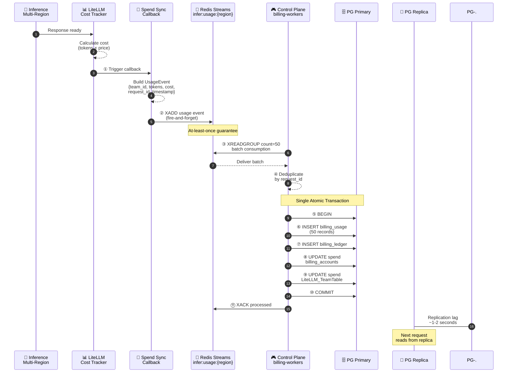
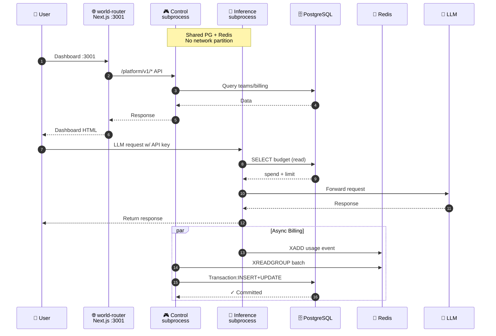
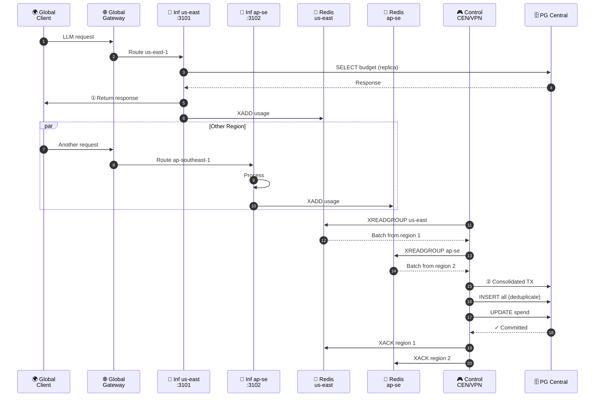
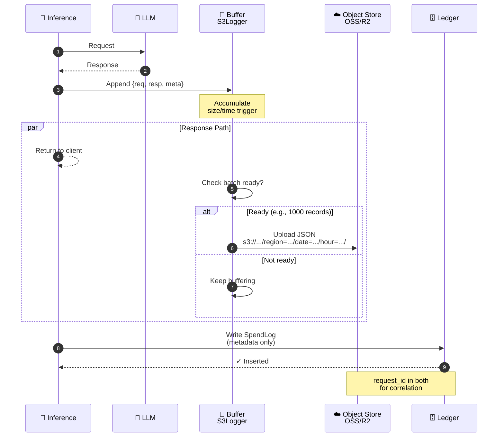
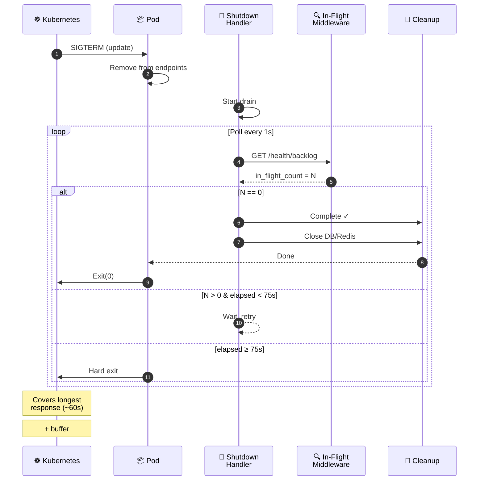
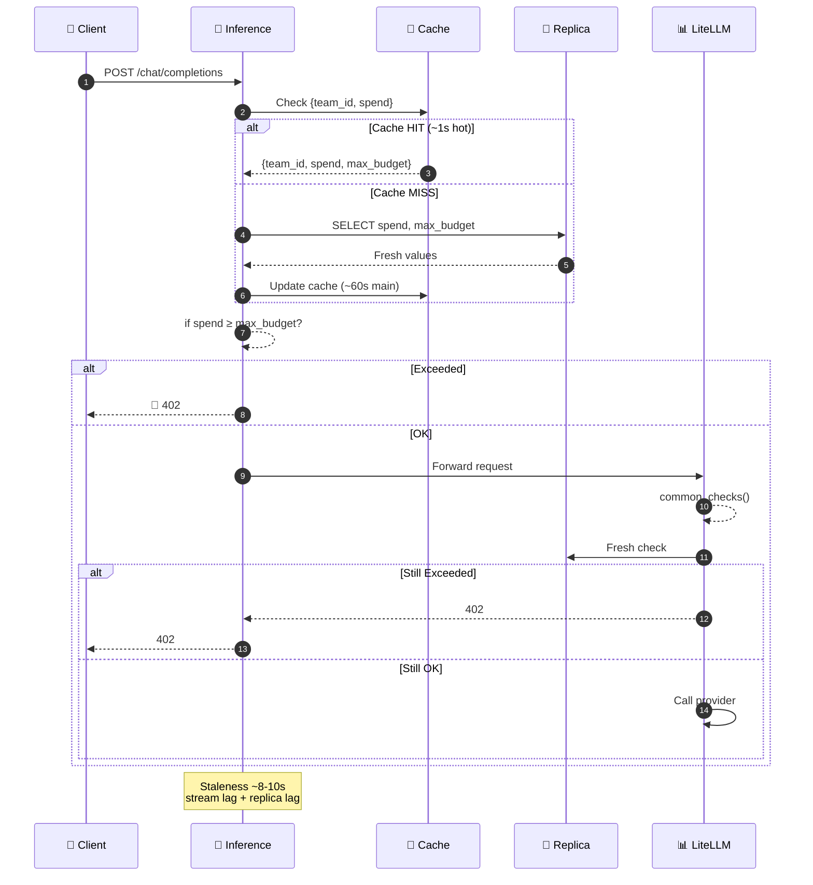
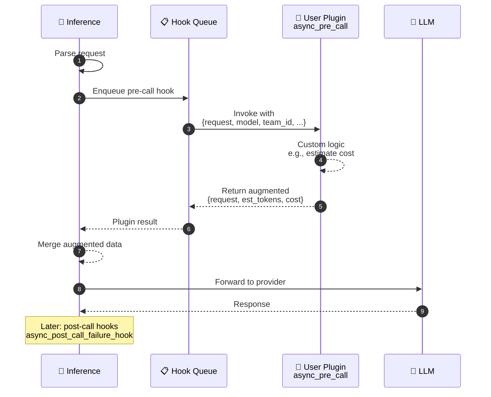

# Inference 核心技术时序图汇总

## 核心架构概览

Infer Inference Node 是**无状态推理网关**，运行在 `DEPLOY_MODE=inference` 模式下：

- ✅ 内嵌 LiteLLM 库处理推理
- ✅ 只读 PG（读副本）
- ✅ 使用量事件通过 Redis Streams 发送到控制平面
- ✅ 支持多区域部署，每个区域独立 Redis 实例
- ✅ 优雅关闭，支持长连接排水

---

## 图 1: 基础推理请求流程 (Request Lifecycle)

**关键点：**
- 请求验证 → 预算检查 → 插件钩子 → LLM 调用 → 异步计费
- 预算检查使用 PG 读副本（8-10 秒陈旧性）
- 响应返回后，异步进行成本计算和计费记录

---

## 图 2: 使用量计费同步流程 (Billing Pipeline)

**关键点：**
- Inference 计算成本 → Redis Streams 发送 → Control 平面批量处理 → PG 原子写入
- 去重机制：`usage_event_id`
- 批处理大小：50 条记录
- 从 1M DAU (~50M 请求/天) 时，减少 PG 负载从 580 tx/s → 12 tx/s

---

## 图 3: 单节点部署流程 (Standalone Mode)

**配置：** `DEPLOY_MODE=standalone`

**特点：**
- 两个子进程：Control + Inference
- 共享 PG primary + 一个 Redis 实例
- 本地开发/测试/IDC 部署
- 数据流与多区域相同

---

## 图 4: 多区域部署流程 (Multi-Region)

**架构：**
- 全局网关 → 多个区域 (us-east-1, ap-southeast-1, ...)
- 每个区域：Inference 节点 + 本地 Redis
- 中央：Control 平面 + 主 PG
- 跨区域通过 CEN/VPN 连接

---

## 图 5: 请求/响应归档流程 (S3 Archival)

**设计：**
- 全请求/响应保存到对象存储
- SpendLog 只保存元数据（token 计数、成本、模型）
- 通过 `request_id` 关联
- S3Logger 批处理，异步非阻塞

---

## 图 6: 优雅关闭流程 (Graceful Drain)

**场景：** K8s 滚动更新

**超时设置：**
- `terminationGracePeriodSeconds: 90s`
- 硬超时：75s（留 15s 清理）
- 轮询间隔：1s

---

## 图 7: 预算检查与拒绝 (Budget Enforcement)

**双层检查：**
1. Inference 节点本地快速检查（使用缓存）
2. LiteLLM 再次检查（fresh read）

**陈旧性：** ~8-10 秒（最坏情况）

---

## 图 8: 插件集成流程 (Plugin Pre-Call)

**钩子：** `async_pre_call_deployment_hook`

**用途：**
- 成本估算注入
- 令牌计数预测
- 自定义请求增强

---

## 关键指标与SLA

| 指标 | 值 | 说明 |
|------|-----|------|
| **预算陈旧性** | 8-10s | 最坏情况（流阻塞 + 副本延迟） |
| **缓存热期** | ~1s | 内存缓存（key/model） |
| **缓存冷期** | ~60s | 主缓存 |
| **副本延迟** | 1-2s | PG 流式复制 |
| **批处理大小** | 50 条 | 每个 XREADGROUP 拉取 |
| **吞吐量** | 12 tx/s | 50M 请求/天 的 PG 负载 |
| **优雅关闭** | 90s | `terminationGracePeriodSeconds` |
| **硬关闭** | 75s | 超时后强制退出 |
| **轮询间隔** | 1s | 检查 in-flight 计数 |

---

## 部署模式对比

| 维度 | Inference | Control |
|------|-----------|---------|
| **LiteLLM** | ✅ 内嵌 | ❌ 无 |
| **PG 访问** | 读副本只读 | 主库读写 |
| **Redis** | 生产者 (XADD) | 消费者 (XREADGROUP) |
| **计费写入** | 无 | UsageStreamConsumer |
| **Dashboard** | 无 | ✅ 有 |
| **可扩展性** | 水平（无状态） | 水平（消费者组） |

